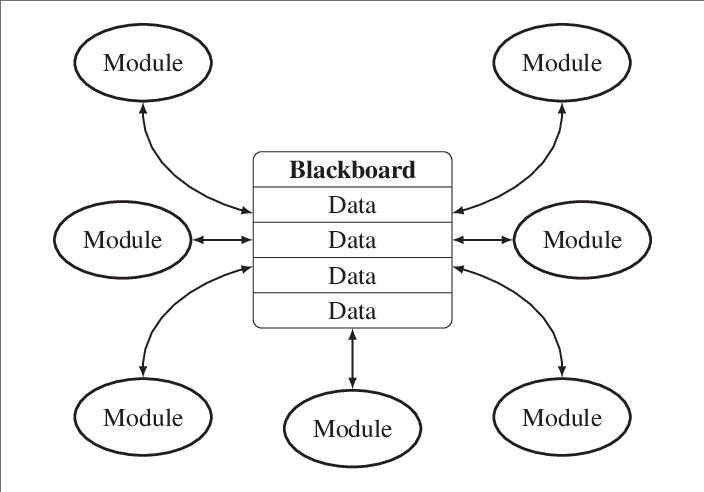
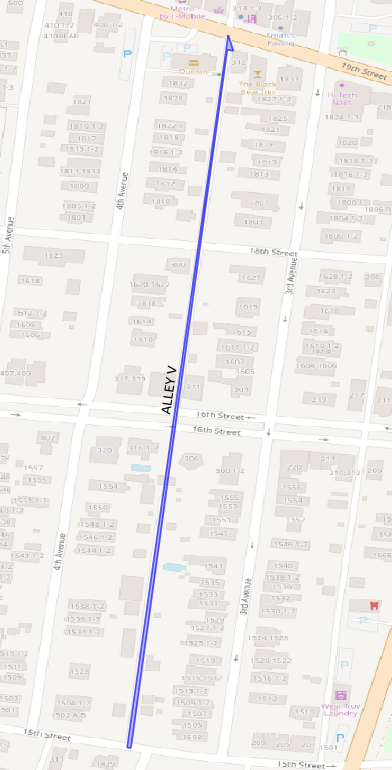
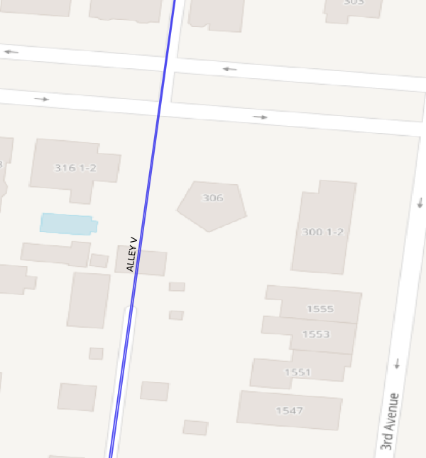

# AVAIL Map Conflation Pipeline

## Software Engineering/Architecture

These following design princples and patterns were adopted early and played a critical
role in our incremental improvement of the conflation system over time. They
facilitate experimentation, analysis, and continuous improvement of the of system.
Their importance to the final product is just as important as the algorithms employed.

### Pipelines

> In software engineering, a pipeline consists of a chain of processing
> elements... arranged so that the output of each element is the input of the
> next; the name is by analogy to a physical pipeline.

_[Wikipedia: Pipeline (software)](<https://en.wikipedia.org/wiki/Pipeline_(software)>)\_

The high-level structure of the conflation pipeline shown below:

The TargetMaps (NYS RIS, NPMRDS, GTFS) are injested and normalized, then each
is fed through a process that ultimately assigns SourceMap (SharedStreets/OSM)
road segments to the TargetMap road segments. The final step of the process is
to combine the output of the previous stages into a conflation map that splits
the road segments so that each segment is 1-to-1 with the NYS RIS, NPMRDS, and
SharedStreets segments.

Each pipeline stage is itself comprised of smaller transformation pipelines
that incrementally generate the final conflation map. Many of these
intermediate stages save their output to small, sometimes temporary, local
databases (SQLite). Furthermore, all modules that transform data use software
patterns and paradigms that facilitate their isolation from the larger system.

This approach of persisting the intermediate data in databases, combined with
the ability to isolate system submodules, has proven invaluable to the
development of the system's algorithms and heuristics. Understanding and
improving the behavior of system submodules becomes much simpler when they can
be isolated and subjected to rapid experimentation using a subset of data that
exposed their shortcomings.

#### Injest & Normalization

The first step in the conflation pipeline is to injest the TargetMaps (RIS,
NPMRDS, and GTFS) and transform their distinct data schemas into a single
uniform schema.

The benefit of this intitial processing step is that all downstream processing
uses common data structures and interfaces for all TargetMaps.

Much care was given choosing the uniform schema. Our reserch led to to the
**Path Property Graph Model**:

> In a graph, there is also a (possibly empty) collection of paths; where a
> path is a concatenation of existing, adjacent, edges. Further, given that
> nodes, edges and paths are all first-class citizens, paths have identity and
> can also have labels and <property,value> pairs associated with them.

_[G-CORE A Core for Future Graph ery Languages Designed by the LDBC Graph ery Language Task Force](https://arxiv.org/pdf/1712.01550.pdf)_

The central role of the Path Property Graph Model to the conflation process is
discussed below. For now, please note that the output of the injest stage includes
_connected sequences of the map road segments stored as "Paths"_.

#### Open For Extension

Because map conflation is an open problem it is important that the
core architecture of the pipeline's map matching stage "Open for Extension".
The architecture must support an evolving ensemble of specialized modules
that collaborate in an opportunistic manner to match the TargetMaps to the SourceMap.

This architecture supports experimentation and research.
Variations of algorithms/heuristics can be run alongside each other for direct
comparison. Furthermore, modules whose sole purpose is analysis or
inspection can be plugged into the system to improve observability of the
subcomponets and their performance.

Most importantly, openness to extension enables the system to easily integrate
any advances in the the state-of-the-art to improve the pipeline's performance.

##### The BlackBoard Pattern

To achieve above described openness, we chose the Blackboard architecture pattern:

From [NUClear: A Loosely Coupled Software Architecture for Humanoid Robot Systems](https://www.researchgate.net/figure/In-a-blackboard-architecture-all-modules-communicate-by-reading-from-and-writing-to-a_fig5_301358808)

> A blackboard system is an artificial intelligence approach based on the
> blackboard architectural model, where a common knowledge base, the
> "blackboard", is iteratively updated by a diverse group of specialist
> knowledge sources.... Each knowledge source updates the blackboard with a
> partial solution when its internal constraints match the blackboard state. In
> this way, the specialists work together to solve the problem.

> The following scenario provides a simple metaphor that gives some insight
> into how a blackboard functions:
>
> > A group of specialists are seated in a room with a large blackboard. They
> > work as a team to brainstorm a solution to a problem, using the blackboard as
> > the workplace for cooperatively developing the solution.
>
> > The session begins when the problem specifications are written onto the
> > blackboard. The specialists all watch the blackboard, looking for an
> > opportunity to apply their expertise to the developing solution. When someone
> > writes something on the blackboard that allows another specialist to apply
> > their expertise, the second specialist records their contribution on the
> > blackboard, hopefully enabling other specialists to then apply their
> > expertise. This process of adding contributions to the blackboard continues
> > until the problem has been solved.

_[Blackboard system Wikipedia](https://en.wikipedia.org/wiki/Blackboard_system)_,
_[Blackboard Systems Interview](http://gbbopen.org/papers/ai-expert.pdf)_

## The Algorithms

Map conflation algorithm consists of 3 stages.

1. Matching
2. Choosing
3. Assigning

### Matching: the Hidden Markov Map Matching Algorithm

AVAIL currently uses SharedStreets to get initial suggestions for NYS RIS,
NPMRDS, and GTFS to OSM map matching. SharedStreets, in turn, uses the Open
Street Routing Machine (OSRM) to perform matching.
(_[source code](https://github.com/sharedstreets/sharedstreets-js/blob/98f8b78d0107046ed2ac1f681cff11eb5a356474/src/graph.ts#L22)_)

OSRM uses the Hidden Markov Model Matching to match sequences of coordinates to the OSM road map.
(_[source code](https://github.com/Project-OSRM/osrm-backend/blob/41dda32546399f1dc12af1de41668993de44c7dc/src/engine/routing_algorithms/map_matching.cpp)_)

- _[Hidden Markov Map Matching Through Noise and Sparseness Paul Newson and John Krumm](https://www.microsoft.com/en-us/research/wp-content/uploads/2016/12/map-matching-ACM-GIS-camera-ready.pdf)_
- _[Online map-matching based on Hidden Markov model for real-time traffic sensing applications; C.Y. Goh et al.](http://www.mit.edu/~jaillet/general/map_matching_itsc2012-final.pdf)_

- From [HMM map matching](https://github.com/bmwcarit/barefoot/wiki#hmm-map-matching):

> A Hidden Markov Model (HMM) assumes that a system's state is only observable
> indirectly via measurements over time. This is the same in map matching where
> a sequence of position measurements (trace), recorded e.g with a GPS device,
> contains implicit information about an object's movement on the map, i.e.
> roads and turns taken. Hidden Markov Model (HMM) map matching is a robust
> method to infer stochastic information about the object's movement on the
> map, cf. [1] and [2], from measurements and system knowledge that includes
> object state candidates (matchings) and its transitions (routes).

- [BMW Car IT GmbH Barefoot Project README](https://github.com/bmwcarit/barefoot#tracker-server-quick-start)

> Online (real-time) map matching of a GPS trace in Munich city area with most
> likely position (blue dot) and alternative possible positions and routes
> (green dots and paths with transparency according to their probability).
> Alternative positions and routes disappear with continuously processed
> updates, which shows the principle of online map matching converging
> alternatives over time.

For another illustration of the problem:

[Map Matching in a Programmer's Perspective](https://github.com/valhalla/valhalla/blob/master/docs/meili/algorithms.md)

> In this figure we see a noisy GPS sequence of 4 measurements, from green to
> red. Each measurement could match one of its candidates nearby (the small
> markers in cyan) but which is the most likely one? The answer is 0, 4, 9, 11
> respectively. That is our most likely sequence of candidates, which
> constructs the red matched route.

_Valhalla Project's [Map Matching in a Programmer's
Perspective](https://github.com/valhalla/valhalla/blob/master/docs/meili/algorithms.md#map-matching-in-a-programmers-perspective)
page_

#### Difference Between Standard Map Matching Use Cases and Road Network Conflation

##### Routability and Timestamps

The applications for which HMM was designed involve

> find[ing] the most likely road route represented by a time-stamped sequence
> of latitude/longitude pairs.
>
> Map matching is the procedure for determining which road a vehicle
> is on using data from sensors. The sensors almost always include GPS
> because of its nearly ubiquitous availability. Map matching has been
> important for many years on in-vehicle navigation systems which must
> determine which road a vehicle is traversing in real time. More recently, map
> matching is becoming important as vehicles are used as traffic probes for
> measuring road speeds and building statistical models of traffic
> delays. These models, in turn, can be used to find time-optimal
> driving routes that avoid traffic jams. Data from such traffic
> probes has been used in the commercial routing engines of Microsoft [6],
> Dash [7], and Inrix [8]. Map matching is also growing in importance
> for research in route prediction [11], interpreting GPS traces [1], and
> activity recognition [14].

_[Paul Newson and John Krumm pg 1](https://www.microsoft.com/en-us/research/wp-content/uploads/2016/12/map-matching-ACM-GIS-camera-ready.pdf)_

So, in general, for the usual HMM use case think turn-by-turn navigation or
fleet monitoring. In these use cases, the vehicle starts at a destination and
records/emits a timestamped GPS trace while it navigates through the road network
to a destination. Throughout the navigation, one can assume that the vehicle obeyed
traffic laws if it encountered one-way streets or turn restrictions. OSRM calls
this assumption "Routability" and it plays a central role in its map matching
algorithms.

Furthermore, the GPS traces would usually entail traversing more of the road
network than a single block or exit ramp. Referring to the animation above,
notice how the algorithm remains undecided around exit ramps and smaller
road sections until after the vehicle has traversed further along its route.

When performing the map matching for NYS RIS and NPMRDS, there are no timestamps.
These maps include very short segments around intersections and junctions for
which pure HMM performs poorly. Furthermore, the RIS map is a centerline map
that excludes one direction of divided roadways. In some cases, cartography
simplifications result in a road's representation traversing through buildings
where the actual road network may involve a discontinuity for a street.
NYS RIS also includes service roads and trails that are not routable for
normal traffic and thus ignored by OSRM's map matching algorithm without
special configuration.

#### TargetMapPaths

As mentioned above, the input TargetMaps (NYS RIS, NPMRDS, GTFS)
are transformed into Path Property Graphs during injest.
For NYS RIS and NPMRDS, these TargetMapPaths are assembled using
information available in the map metadata

- NYS RIS **DOT_ID**: "A computer system ID used by NYSDOT as a unique reference
  for a particular route or road." -- [NYS RIS
  Documentation](https://gis.ny.gov/gisdata/metadata/dot.Field-Descriptions-Codes-Roadway-Inventory.xls)

  This seems equivalent to the HPMS "ROUTE_ID", which is described in the
  documentation as "the unique identifier for a given roadway (i.e., route).
  Used for linear referencing attributtes through the Dynamic Segmentation
  process." -- [HPMS
  Documentation](https://www.fhwa.dot.gov/policyinformation/hpms/shapefiles.cfm)

  DOT_IDs span many map segments. With NYS RIS, the beginning milepoints are
  used to order the road segments (TargetMapEdges) along the TargetMapPath.

- NPMRDS **TmcLinear**: "A reference to the “Linear TMC” that includes the TMC
  Segment. Typically, several TMC Segments are part of a Linear TMC, which
  usually represents a road corridor through a single county. The purpose of
  this column is to provide assistance for filtering and locating TMC Segments
  and simplifying the process of linking consecutive TMC Segments. Note that
  care must be taken when linking consecutive TMC Segments in the exception
  cases where multiple TMC Codes refer to the same stretch of road."
  -- [NPMRDS Documentation](https://npmrds.ritis.org/static/help/docs/NPMRDS.pdf)

  As NPMRDS does not include milepoints, graph algorithms are used to order the
  TMCs into a TargetMapPath.

- For GTFS, the route shapes are already paths.

Feeding the HMM matching algorithm long TargetMapPaths (Routes) rather than
small TargetMapEdges (blocks, ramps, etc) vastly improves the matching
performance.

For the NYS RIS centerline map, the TargetMapPath is reversed and fed through
the HMM matcher to get directed match recommendations.

### Choosing Matches

During the HMM Matching stage of the pipeline, any recommendation is better
than no recommendation. Therefore, we pass the HMM algorithm different
configurations as well as mutations of the TargetMapPaths. The Matcher may thus
recommend multiple OSM Ways (road network segments) for a given section of the
TargetMapPath.

The Chooser uses geospatial heuristics to choose an optimal path through the
OSM road network to represent TargetMapPath. We then break down the OSM Way
matches recommended for a TargetMapPath to recommendations by TargetMapEdge
using an algorithm that minimizes root-mean-square deviation of distance.

The output of the Chooser is a single OSM match suggestion for each road segment
represented by a TargetMapPath.

### Assigning Matches

The HMM algorithm works extremely well for TargetMapEdges internal to the TargetMapPath,
not as well for the external (first and last) edges of a TargetMapPath.

It is the job of the Assigner to resolve conflicts between TargetMapEdge ChosenMatches.
The Assigner applies a myriad of rules, such as

- prefer ChosenMatches of internal TargetMapPathEdges over external TargetMapPathEdges.
- prefer higher level (major) roadways over lower level (local) roadways
- prefer ChosenMatches for unreversed TargetMapPathEdges over reversed TargetMapPathEdges

At the end of the Assigner stage, there is one OSM road segment assigned to any
TargetMap segment, and one TargetMap segment assigned to any OSM road segment.

## Future Work
