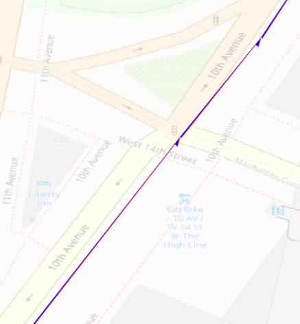

# PROBLEM: Inconsistent Direction Edges

## DESCRIPTION

Some NYS RIS segments represent one way streets with internally inconsistent directionality.

The blue arrowed line above is a single segment from the 2020 NYS RIS.
(The indvidual arrows break at nodes within a single map segment.)
The RIS segment represents multiple one-way blocks of 10th Avenue in NYC.
At West 14th Street, the directionality of the one-way blocks change.

## CONSEQUENCE

We CANNOT assume that the directionality of a single NYS RIS segment is
internally consistent.

This means that the conflation for that segment would change
between fwd/bwd within the segment.

This poses a challenge for topological-based matching algorithms.

The correct matching for that segment would be partially forward, partially backward.
