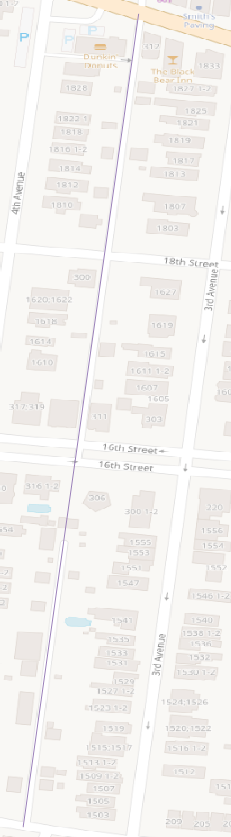
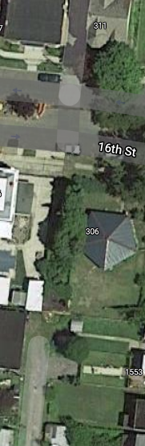

# PROBLEM: Edges traverse the untraversable

## DESCRIPTION

Some NYS RIS segments go where there are no roads.

The line above is a single segment from the 2020 NYS RIS.
It continues over a curb, through lawns, and through a building.

## CONSEQUENCE

This poses a challenge for topological-based matching algorithms.

The correct matching for that segment would have a gap.

Collecting unmatched SharedStreetsReferences based strictly on
spatial buffers may work. Obviously, routing-based matching won't.
